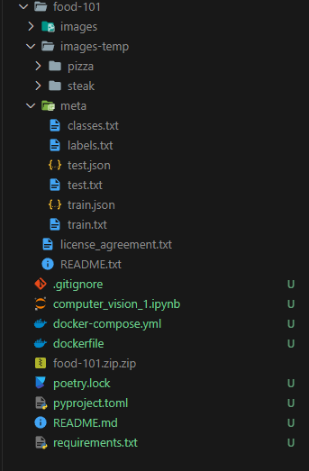

# Computer Vision Template

## Setup
Use `docker compose up` to use the project. 

Poetry is not supported rn, so add additional reqs to [requirements.txt](./requirements.txt).

## Project Overview
This project is based on this [research paper](https://data.vision.ee.ethz.ch/cvl/datasets_extra/food-101/) but instead of random forests, we use convolutional neural networks, abstracted via the TensorFlow Keras API. 

Of the [dataset](http://data.vision.ee.ethz.ch/cvl/food-101.tar.gz) this project only uses the pizza and steak parts, with a 80-20 split for training and validation.

## Folder Structure
Your folder structure should look like this when the project is setup after you download the dataset. Where `pizza` and `steak` are folders copied from the `images` directory.

